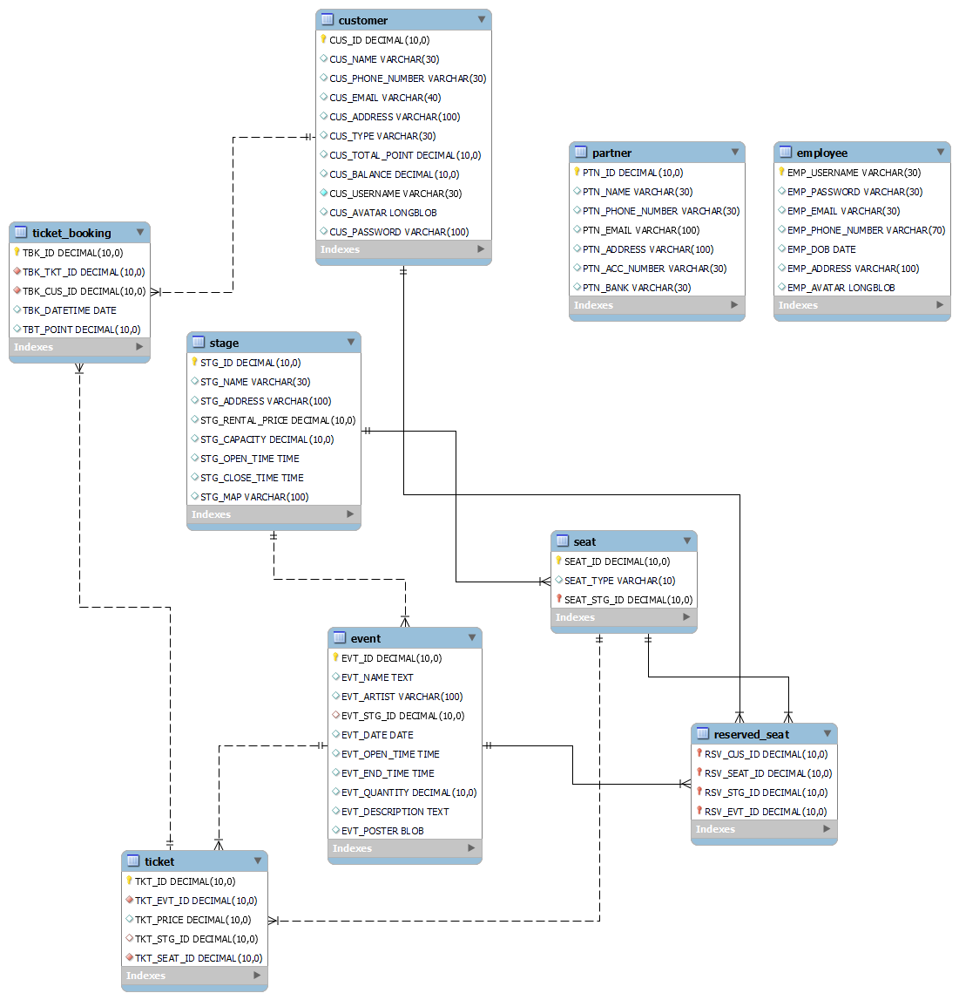

# Music Concert Ticketing Management System - MUZICTIK

### 1. Introduction
The Music Concert Ticketing Management System is a system that is linked with music event organizers and serves as the entity responsible for ticket purchasing and sales. The system provides a comprehensive list of customer information, event details, partners, stages, and more. The system's manager can easily search for necessary information for convenient checking and management. With the development of the ticket distribution system to optimize the ticket distribution process, the project team hopes to make ticket distribution more efficient and convenient for users. Additionally, this system can help music event organizers save time and costs in managing tickets. 
### 2. Research Objectives 
The objective of the Music Concert Ticketing Management System project is to develop an application for managing concert ticket sales in Vietnam, making the process easier and more convenient for companies looking to develop the music concert industry. The research aims to focus on improving the basic functions of the application, enhancing its performance and features, and optimizing the ticket management process for music concerts. The ultimate goal of the project is to create a high-quality application that meets all project requirements and fulfills the needs of concert production partners in Vietnam. The project includes the following main features: 

• Managing information of customers, partners, events, tickets and stages. 

• Managing information of users (employee, manager or customer).

• Ticket purchasing management, ticket inventory management, and ticket refund management for events, with the ability to receive tickets via email. 

• Ensuring effective information retrieval for all related parties. 

• Managing ticket sales revenue on a daily/monthly/yearly basis. 

• Managing the number of tickets sold per day/week/month. 

• Managing invoice information for each ticket purchase. 

• Storing information in a way that allows for quick and efficient data output. 

• A user authorization system to ensure system security and safety. 

• Backup.
### 3. Member of Group 9
|    ID    |       Name       |         Email          |
|:--------:|:----------------:|:----------------------:|
| 21520430 |  Lê Xuân Quỳnh   | 21520430@gm.uit.edu.vn |
| 21520756 | Nguyễn Đại Dương | 21520756@gm.uit.edu.vn |
| 21521115 |  Trương Gia Mẫn  | 21521115@gm.uit.edu.vn |
| 21521938 | Nguyễn Thành Đạt  | 21521938@gm.uit.edu.vn |
### 4. Entity Relationship Diagram model

### 5. The main funtions in an application
* Register an account
* Log in
* Manage personal account information
* Managa music events
* Manage customers
* Manage partners
* Manage organized stages
* Manage employees
* Manage payment methods
* Purchase music event tickets
* Manage purchase history
* Receive tickets via email
Generate statistical reports
* Manage ticket for music events
### 6. Developer tools & Technology 
* Programming language used: Java * 
* IDE used: IntelliJ IDEA 
* GUI programming tool: JFormDesigner - Java/Swing GUI Designer 
* Database: MySQL 
* Analysis and design tool: StarUML 
* Project management software: Git, Github 
* Reporting tool: Microsoft Word
### 7. System requests
* Using JDK 18
* Using ojdbc8.jar
### 8. Installation guide
* Step 1: Clone the project to your local machine.
* Step 2: Open IntelliJ IDEA and choose Open project. Navigate to the cloned project and open it.
* Step 3: Add all necessary libraries in the lib folder.
* Step 4: In src/Model/Database, there is a ScriptDatabase.sql file. Access MySQL and create a new user with the following information:
```
Username: newuser
Password: 123456a@b@
```
* Step 5: Import the data from the ScriptDatabase.sql file into the database.
* Step 6: Run the src/Application/Main.java file to launch the program.